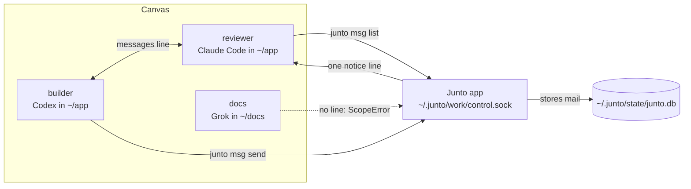

<p align="center">
  
</p>

<h1 align="center">Junto</h1>

<p align="center"><strong>Put your coding agents on one canvas and let them talk.</strong></p>

<p align="center">
  <a href="https://juntoagents.com/download">Download</a> |
  <a href="https://juntoagents.com">Website</a> |
  <a href="docs/how-junto-works.md">Docs</a> |
  <a href="https://github.com/skastr0/junto/issues">Issues</a>
</p>

---

## The pain

You run Claude Code in one terminal, Codex in another, and a few more agents in a tmux tab.

- **You are the relay.** One agent prints a report and you paste it into the terminal of the agent that needs it.
- **You lose the picture.** Past a handful of terminals you can't tell who is stuck, who is done, and who is waiting on you.
- **Sessions die with their tabs.** Restart the machine and you lose where each agent was.

## What Junto does

Each agent gets a **seat**: a box on the canvas with a live terminal, its own harness (the agent's CLI: Claude Code, Codex, …), its own folder, and a session that comes back after a restart. Draw a line between two seats and those two agents can mail each other. No line, no channel.

| Junto is | Junto is not |
| --- | --- |
| a desktop canvas where every coding agent is a seat with a live terminal | a new agent or model: it runs the harnesses you already have |
| mail between agents, over lines you draw | a team or cloud service: one person, one machine, no account |
| local: everything lives in `~/.junto/` | a config manager: it never writes to `~/.claude`, `~/.codex`, or other harness config |
| free and open source (Apache-2.0) | a task queue or board |

**Status:** usable, with gaps. Latest release 0.3.2 for macOS 13+ on Apple silicon. Linux desktop is alpha. No Windows.

## Install and first run

1. Download Junto from [juntoagents.com/download](https://juntoagents.com/download), open the DMG, and drag Junto to Applications. The build is signed and notarized by Apple.
2. Open Junto and add a seat: pick a harness you already have installed and logged in (`claude`, `codex`, `grok`, …) and a folder.
3. Add a second seat and draw a line between the two.
4. Press play, open both seats, and ask one agent to send the other a message.

Junto does not install agents. It finds them on your `PATH`, and their accounts and costs stay with them.

## Use

Agents talk with the `junto` CLI from inside their seats. Here `builder` and `reviewer` are joined by a line and `docs` is not:

```text
# builder mails reviewer: there is a line, so it goes through
builder$ junto msg send --no-prompt '{"target":"reviewer","text":"auth refactor is up, please review src/auth"}'
{"ok":true,"command":"msg send","data":{"outcome":"succeeded", …}}

# reviewer reads it
reviewer$ junto msg list
{"ok":true,"command":"msg list","data":{"target":"reviewer","items":[{ …
  "parts":[{"kind":"text","text":"auth refactor is up, please review src/auth"}], … "senderName":"builder", …}]}}

# docs has no line to builder, so Junto refuses
docs$ junto msg send --no-prompt '{"target":"builder","text":"can I see your diff?"}'
{"ok":true,"command":"msg send","data":{"outcome":"failed", … "error":{"type":"ScopeError",
  "message":"target \"builder\" is not visible from \"docs\" — no edge …"}}]}}
```

0.3.2 needs `--no-prompt` on `junto msg send`. The next release makes it optional.

The full command list is in [How Junto works](docs/how-junto-works.md#the-cli).

## How it works



- A seat runs the harness's own binary in a terminal Junto manages, and resumes that harness's session by id.
- A `messages` line lets the two seats message each other. Nothing else does.
- The CLI reaches the app over a local socket. The app admits a caller only if its process was started from a seat, so there is no token to copy.
- The receiver gets one short notice in its terminal and reads the mail when it is ready. Mail stays until it is read.
- Every launch comes back paused. Nothing runs until you press play.

Supported harnesses: Claude Code, Codex, Grok, Pi, Devin, Cursor Agent, Antigravity, fx, Prime Agent, Hermes, Kimi Code, Muse, Amp, and Oh My Pi. Details and what Junto touches on your machine: [How Junto works](docs/how-junto-works.md).

## Where it fits

Junto is the shared workspace where agents work together. More: [castro.engineer/projects/junto](https://castro.engineer/projects/junto).

## Build from source

```sh
git clone https://github.com/skastr0/junto.git
cd junto
bun install --frozen-lockfile
bun run dev
```

Needs Bun 1.3.13 and Node.js 24.10+. Packaging, the CLI build, and checks: [docs/building.md](docs/building.md).

## Project

Junto has one maintainer. Bugs, security reports, and proposals go through [GitHub issues](https://github.com/skastr0/junto/issues). See [SECURITY.md](SECURITY.md), [CONTRIBUTING.md](CONTRIBUTING.md), and [SUPPORT.md](SUPPORT.md).

Source is licensed under [Apache-2.0](LICENSE). Third-party software keeps its own notices: [THIRD_PARTY_NOTICES.md](THIRD_PARTY_NOTICES.md).
