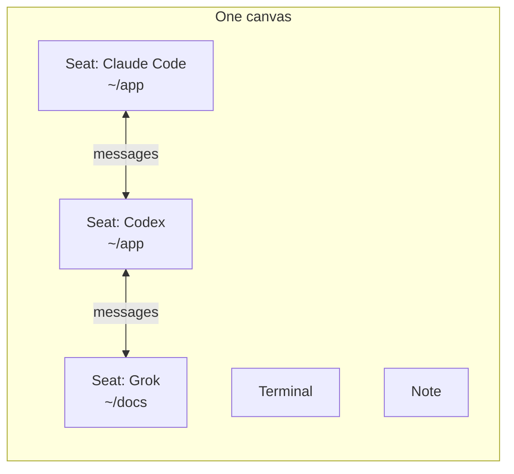

<p align="center">
  
</p>

# Junto

**Give each of your coding agents a seat. Let them see each other.**

Junto is a free, open-source desktop app for running several coding agents at
once, together, on one canvas. Claude Code, Codex, Grok, Cursor, Amp, Devin,
and more sit side by side as permanent seats. You draw who can talk to whom.
They mail each other, keep their sessions across restarts, and never touch your
harness config.

macOS on Apple silicon. Linux desktop in alpha. Apache-2.0. No account.

[Download](https://juntoagents.com/download) | [Website](https://juntoagents.com) | [Docs](https://juntoagents.com/docs) | [Issues](https://github.com/skastr0/junto/issues)

## Why Junto

Today you run one harness at a time. One terminal, one session, one agent.
When you want two agents on the same problem, you become the relay: copy from
one tab, paste into the other, remember which is which, and lose all of it when
the session ends.

Junto turns each agent into a seat. A seat is a named, permanent identity on a
canvas, with its own harness, its own working directory, and its own resumable
session. Seats stay where you put them. Close the app, come back, and the same
agent picks up the same session. Draw a line between two seats and they can
send each other mail. You watch all of it in one window.

## The insight

We spent months running crews of up to nine agents at a time, then went back
through the sessions and asked what made the good runs good.

It was not the model, the harness, the prompts, or the number of agents. Same
models, same tools, very different outcomes. Prose rules did not help either.
Agents recited the rules and then broke them under task pressure, again and
again.

What worked was structure. When the environment made checking a claim the
easiest next step, agents checked. When a second agent had to look before
"done" counted, false "done" stopped. Better work became the path of least
resistance, so that is where the agents went.

That is the bet behind Junto. Do not ask agents to collaborate well. Build the
room so that collaborating well is the easy thing to do. Seats, visibility, and
mail are the foundation and they ship today. More of the structure we saw work
is in the source behind feature flags, and we will write it up as it lands.

## What you will see



1. **A canvas.** Every agent is a box with a live terminal inside it.
2. **Seats.** Each box is one harness, one working directory, one named
   session. It survives app restarts.
3. **Lines.** You connect seats. A `messages` line lets two agents mail each
   other. No line, no channel.
4. **Mail landing.** When one agent writes to another, a short notice appears
   in the other agent's terminal, and that agent reads the mail with the
   `junto` CLI.
5. **Your view.** Idle, working, waiting for input. Zoom out and see the whole
   crew at once.
6. **An overseer, if you want one.** Flip a switch on any seat and that agent
   can set up the canvas for you.

## One harness at a time vs Junto

| | One harness at a time | Junto |
| --- | --- | --- |
| Agents | One per terminal, blind to each other | Many, side by side, aware of each other |
| Identity | A session that ends with the tab | A permanent seat with a resumable session |
| Talking between agents | You copy and paste | Agents mail each other over the lines you draw |
| Who decides access | Whatever the prompt says | The canvas. No line, no access |
| Your config | Per harness, per project | Untouched. Junto changes nothing in it |
| Overview | Tabs | One canvas |

## Install

1. Download the macOS build from [juntoagents.com/download](https://juntoagents.com/download).
   Open the DMG and drag Junto to Applications. Official builds are signed and
   notarized. macOS 13 or later, Apple silicon.
2. Open Junto and choose the local Command Center role when asked.
3. Add a seat, pick a harness you already have installed, pick a folder, and
   start it.

Linux desktop is alpha, initially Ubuntu 24.04 x86-64 with glibc 2.39. Follow
[the Linux desktop guide](docs/linux-command-center-alpha.md) and
[the bootstrap guide](docs/linux-desktop-bootstrap.md). The managed install
stays inside your account and never asks for administrator credentials.

Junto does not install agents for you. Install and log in to the harnesses you
want, for example `claude`, `codex`, or `grok`, the way you normally do. Junto
finds them on your `PATH`. Their accounts and provider costs stay with them.

## What Junto changes in your setup

Nothing.

- Junto never writes to `~/.claude`, `~/.codex`, `~/.grok`, `~/.hermes`, or
  any other harness config.
- A seat runs the same binary you run by hand. Junto passes only the dials you
  chose in the seat (model, effort, permission mode) plus its own instructions,
  through the harness's system-prompt flag or as the first typed message.
  Look-and-feel flags are never emitted, so your own settings apply.
- Everything Junto owns lives in `~/.junto/`. Delete the app and that folder
  and Junto is gone.
- Inside a seat's process, and only there, Junto prefixes `PATH` with the
  `junto` CLI and sets a few `JUNTO_*` variables so the agent can reach the
  app.

## Supported harnesses

Claude Code, Codex, Grok, Pi, Devin, Cursor Agent, Antigravity, fx, Prime
Agent, Hermes, Kimi Code, Muse, Amp, and Oh My Pi.

Each harness has a template in the source that records how it launches, how its
session is named and resumed, and which dials it exposes. Fidelity varies by
harness and version. `junto doctor` reports what was probed on your machine.

## How Junto works

**The canvas is a document.** A canvas is a [JSON Canvas](https://jsoncanvas.org)
document. Nodes are agents, terminals, notes, labels, git cards, and regions.
Edges are relationships. You author it in the app. Agents do not write it,
unless you make one an overseer.

**A seat is a process with a name.** An agent node bound to a harness gets a
managed terminal, a real PTY, running that harness in the folder you chose.
Junto pins or captures the harness's session id and stores it, so the seat
resumes that exact session, never "whatever ran last".

**Access comes from lines.** An edge compiles into a set of grants. A
`messages` edge between two agents gives each a mailbox to the other. No edge,
no grant, and the CLI refuses with a scope error that says so.

**Agents talk through the CLI.** The `junto` CLI talks to the app over a local
socket. Identity is process-bound: the CLI must be running inside a seat the
app started. There is no token to paste and nothing to configure.

**Mail is pull-based.** `junto msg send` writes. The receiving seat gets a
short typed notice in its terminal and reads with `junto msg list`. Nothing is
injected mid-thought, and mail is durable until read.

**State is one local file.** `~/.junto/state/junto.db`, SQLite. JSON Canvas
exports are outputs, never inputs the app watches.

**Play and pause.** A playing canvas re-occupies its seats when the app
launches. A paused canvas starts nothing on its own. Local terminal processes
belong to the app and stop when it quits.

**Overseer.** A human-toggled switch on one seat. That agent may author the
canvas and use every node API without edges. It cannot delete its own seat or
move your view, and only you can grant or revoke it. See
[the security doctrine](docs/security-doctrine.md).

## What Junto requires

- macOS 13 or later on Apple silicon, or Ubuntu 24.04 x86-64 (alpha).
- At least one supported harness installed and logged in.
- Network access for whatever your harnesses use, and for the update check in
  official builds.

No account, no activation key, no payment.

## In the source, off by default

Task queues, review verdicts, request escalation, artifacts, shared boards,
pads, sheets, browser pages, schedulers, Fleet, Remote stations, and the voice
overseer exist in the source behind feature flags
([feature-catalog.ts](src/shared/feature-catalog.ts)). They are off in
official builds until they are good enough to ship. Opening the source does not
change those defaults.

## Build from source

Requirements: Bun 1.3.13 (see `package.json`), Node.js 24.10 or later, macOS or
Linux with an interactive desktop session, Git, and the platform's native build
tools.

```sh
git clone https://github.com/skastr0/junto.git
cd junto
bun install --frozen-lockfile
bun run dev
```

The development app uses `~/.junto-dev/`. The packaged application uses
`~/.junto/`. To package locally:

```sh
bun run build              # package locally, skipping source checks
bun run app:build:mac      # local macOS package, run on macOS
bun run app:build:linux    # local Linux desktop package, run on Linux
```

Local packages are development builds without a signing identity. Automatic
updates and Remote package admission require the official signing identity
compiled into an official build. The maintainer's signing, notarization, and
publication tooling lives in a private distribution repository. GitHub
Releases are not the application update feed.

## Agent tools

Build the CLI with `bun run cli:build`; the result is `dist/junto`. Packaged
applications include the same CLI as `bin/junto`.

```sh
dist/junto doctor
dist/junto capabilities
dist/junto onboard
```

Protected operations require the CLI to run under an agent process registered
by the running app. Operator projection tools read the running application's
control socket without opening the product database:

```sh
bun run canvas:ls
bun run digest
bun run render
```

See [the security doctrine](docs/security-doctrine.md),
[the Work and Station contract](docs/junto-protocol.md), and
[the macOS privacy audit](docs/macos-privacy.md) for the detailed boundaries.

## Development checks

```sh
bun run verify             # lints, typecheck, tests, ship-profile checks, compile
bun run test:e2e           # all-on GUI smoke: startup spec only
bun run test:e2e:fast <spec>  # targeted GUI spec against an existing build
bun run test:e2e:full      # full GUI regression suite (not routine)
```

Keep generated screenshots, application state, secrets, and scan reports out
of commits.

## Project

Junto is actively developed by a solo maintainer. Reports and proposals go
through [issues](https://github.com/skastr0/junto/issues); see
[CONTRIBUTING.md](CONTRIBUTING.md) and [SUPPORT.md](SUPPORT.md).

Report suspected vulnerabilities privately through [SECURITY.md](SECURITY.md).
The trust model is one operator with trusted but fallible attached agents; the
app enforces its own process, edge, peer, and update boundaries.

Project-owned source is licensed under [Apache-2.0](LICENSE). Third-party
software and separately identified assets retain their own notices; see
[THIRD_PARTY_NOTICES.md](THIRD_PARTY_NOTICES.md).
