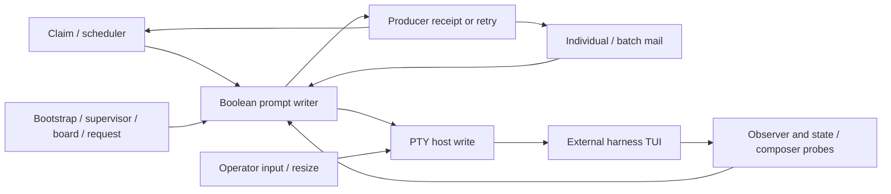

# Junto PTY matrix assessment

Assessment target: `eefaafff30d151c8c28f65d873d9c73bb18d3ae1`, 2026-09-14 UTC.
This is an engineering assessment, not a claim that the reported production defect is fixed.

## Current status, 2026-09-14

**Installed source: `ce3c10ae`. Native checkpoint: PID `41562`.**
The [fresh production replacement proof](pty-fresh-mail-2026-09-14.md#fresh-production-replacement)
verifies the exact signed runtime/archive bytes, named resume, fresh mail
and a new two-board claim/handoff through completion. Its launch-relative
trace has three pastes, three submitted verdicts and no duplicates or
interrupts. The full integrated suite passed 7,141 tests with 62 skips.

The earlier native checkpoint used PID `14290`, source `7d2d6cb1`.
The [native submission repair](pty-native-submission-2026-09-14.md) and
[fresh-mail qualification](pty-fresh-mail-2026-09-14.md) establish visible
delivery through the normal 192-node, 57-edge factory and both warm Devin
seats. The fresh-mail checkpoint has eight physical pastes, eight submitted
verdicts, eight submit CRs and two chip CRs, with no interrupts or duplicate
pastes. Six distinct fresh source comments have six durable mail receipts
and exactly one case reply each. Multiline mail used compact notices plus
full-content CLI retrieval; the claims exercised long PTY pastes. These
receipts belong to the running `7d2d6cb1` package, not the newer source.

| Area | Integrated source corrections |
|---|---|
| Submission and source identity | Positive pending text and accepted ACK evidence, bounded recovery, generation-owned holds, resize interlocks, and own-paste continuation (`3e1da200`, `6df3111f`, `7d2d6cb1`); canonical claim-fact receipt identity (`4cf844a5`). See the [native repair's included corrections](pty-native-submission-2026-09-14.md#other-repairs-included-in-this-package). |
| Mail and supervisor | Immutable accepted batch membership and shared member reservations (`02a420ab`, `b9185f17`, `9832392b`); per-member retry/receipt recovery and rejected-before-write refunds (`c2ee9755`, `ae13b0c7`); supervisor notices counted only after acceptance (`94657fa1`). |
| Observation and attachment | Generation-owned evidence (`93c058b6`), ordered observer bytes/resizes (`4b45df28`), renderer attachment/output/resize fences (`821dcead`). |
| Composition and session ownership | Concrete pulse transport registration, opaque first-typed arm ownership and re-kick (`3b744c2c`, `871516ed`); exclusive captured-session ownership (`9c905ecf`). Remote mail remains explicitly unsupported. |
| Captured adapters | Muse working and Hermes/Kimi setup refusal (`af9db2e9`), Amp Sending refusal (`30dc6219`), OMP composer/working evidence (`d845d8b7`), and untitled Amp readiness with rounded-box pending evidence (`2a5c1e77`). |

**S9 correction:** the original claim that `snapshotNow()` could pair a grid
with an incoherent sequence was disproven. Buffered bytes may be absent,
but their sequence is absent too: the snapshot describes its last settled
write. The [observer contract](../../src/main/vellum-command/term/observer/session-observer.ts#L593)
and [focused regression](../../tests/seat-state-evidence-coherence.test.ts#L114)
distinguish that lag from the separately fixed reuse of an old
generation's evidence and byte/resize ordering. The historical S9 row below
must not be treated as a confirmed sequence defect.

The current [corpus](../../tests/pty-e2e/corpus) has **36 JSONL captures across
10 external harnesses**: Claude 4, Codex 4, Grok 5, Pi 2, Devin 4, Hermes 3,
Kimi 2, Muse 4, Amp 4 and OMP 4. With ten manifests and one index, that is
47 files. Captured composer/state regressions now cover the added Hermes,
Kimi, Muse, Amp and OMP shapes; captured working/authentication/model failures
are refused. Hermes and Kimi captured setup failures and composer shapes,
with no successful model turn observed in either manifest. Muse used its
deterministic echo provider, with no remote model turn. This qualifies
specific recorded adapter cases, not ten native
factory integrations. Cursor, Antigravity, fx and Prime Agent still have no
committed JSONL corpus. Amp's replacement recordings preserve initialization
and prove a recorded hello acknowledgement through the actual drive
(`134deb27`). They also retain a later prompt still queued as steering input;
that state is not claimed accepted or idle. These changes are included in
the installed `ce3c10ae` package; Amp itself has recorded-byte qualification,
not native factory qualification.

Still open: the remaining producer/harness/input/resize matrix,
full Remote execution proof, and the [Remote mailbox delivery contract](pty-remote-mail-plan-2026-09-14.md).
The external acceptance-to-durable-receipt crash window (S11) remains;
raw PTY writes cannot promise durable exactly-once delivery.

Everything below retains the original `eefaafff` assessment, counts and test
results as historical evidence. They are not current open-defect or coverage
counts; the status and S9 correction above take precedence.

## Verdict

The failures concentrate in shared delivery identity, submission evidence, and asynchronous ownership. They also expose incomplete harness adapters. This requires a coherent submission protocol across producers, the drive, observers, and receipts; independently tuning Enter delays in fourteen adapters cannot establish correctness.

A raw terminal write acknowledges bytes accepted by the host. It does not acknowledge a prompt accepted by the harness. The application currently compresses pre-write refusal, post-write uncertainty, and inferred submission into a boolean. Several callers retry or stamp durable receipts from that boolean. Separately maintained queues, source identities, batch membership, timers, and generation locks can disagree about the same physical submission.

Exactly-once acceptance cannot be promised across a crash by an arbitrary external TUI that does not expose correlated, durable acknowledgements. The implementable contract must preserve uncertain writes, expose them, and avoid blindly replaying them. Stable delivery IDs are necessary but do not make the external harness idempotent.

## Evidence boundaries

| Evidence | What it establishes | What it cannot establish |
|---|---|---|
| Current source, independently checked | Reachable branches and missing ownership contracts | Current external TUI behavior |
| Isolated probes importing production classes | Specific deterministic interleavings and service outcomes | OS delivery, real harness repaint or GUI behavior |
| Recorded PTY replay | Parser and classifier behavior on the captured bytes | Current harness version/configuration or live input timing |
| Native packaged-app observation | The visible behavior of the actual running package and session | Every source branch without correlated tracing |
| Passing existing tests | Those assertions passed under their fixtures and seams | Completeness of the matrix |

Typecheck and the full repository test command also passed: **6,932 tests passed, 62 skipped**. The required full suite used `--testTimeout=15000`, matching the prior verified run.

The targeted existing suites ran during this assessment: **249 passed, one skipped, nine files**. They cover `tests/pty-e2e`, `managed-terminal-drive`, `message-delivery-service`, and `managed-spawn-and-drive-gaps`. Independently executed adversarial probes still reproduce the defects below. Green component tests therefore do not clear the production incident.

The previously observed new production package was verified as source `eefaafff`, main PID 66717, installed archive SHA-256 `b8a42f8181c3cea30f1c8ebace3ff0d9861e5bcd6399bd40546dd1a6f4134d24`. Computer Use subsequently observed literal edge-contract text left in Devin's composer. The new package was running; that symptom cannot be dismissed as the earlier stale installation. That launch did not enable the PTY trace, so the precise live success branch remains unproven. The isolated literal-pending probe demonstrates a reachable matching failure mechanism, not proof of its exact execution in the screenshot.

The earlier full-factory clone exercised 192 nodes, 57 edges and both Devin seats under normal scheduling. It successfully submitted multiple deliveries and completed the task path. Two manual Escapes ended long bootstrap/research turns; no manual Enter submitted the injected messages. It started fresh harness sessions and did not reproduce the original session's stuck composer. This was not a wholly unattended run. See [native verification record](../managed-terminal-verification.md#live-factory-reproduction-2026-09-13).

The assessed build already removed failed-submit Ctrl+C cleanup and added a per-binding `writtenUnresolved` guard. A post-write unresolved result suspends later automatic writes until binding invalidation. Trace events already distinguish `submitted`, `written-unresolved` and `refused-before-write`, but the public writer still returns one boolean. S1 and S2 incorrectly take the success path, bypassing that containment. Explicit `interruptIfBusy` mail policy still has a separate Ctrl+C path; it must not be confused with the removed cleanup loop. These existing changes are in [the assessed drive](../../src/main/vellum-command/term/drive/managed-terminal-drive.ts), not proposed new fixes.

## End-to-end ownership

1. Operator-authored canvas state and durable work generate deliveries: claim briefings, mail, edge notices, scheduler wakes, board notices and request answers. Spawn and the injection supervisor generate additional orientation text.
2. Each producer decides identity, admission and retry independently. Claims retain source-aware retry in the kernel; other paths can queue raw text in the drive.
3. `ManagedTerminalDrive` checks readiness, seat idle, composer state and the operator interlock. It writes bracketed paste, waits, sends CR, sometimes sends a chip CR, and waits for evidence.
4. The host acknowledges the write. The observer independently ingests terminal output and derives screen, state and composer evidence. Operator input and resize arrive through another path.
5. The drive returns a boolean. Producers use it to stamp receipts, retain pending work or retry. Some receipts are durable; several acceptance and coalescing guards are only process-local.

The important boundary is one logical delivery through one seat generation. Neither a shared text body nor a stable binding ID identifies that complete boundary.

### Producer and receipt matrix

| Producer | Route and identity | Acceptance / retry boundary |
|---|---|---|
| Fresh bootstrap through argv/system prompt | Template-specific launch carrier, associated with the occupant | Avoids PTY typing; successful launch does not prove instruction uptake or later injection |
| First-typed bootstrap | Binding arm, managed drive with `awaitTurnStart:false` | Arm consumed on boolean success; can use a temporary composer exception |
| Injection supervisor | Per-generation orientation budget, direct managed writer | Increments `orientationsDelivered` before calling the writer and ignores its result; attempted and delivered are conflated |
| Claimed-task briefing | Kernel claim/progress-derived key, non-queuing pulse bridge | Kernel retries and stamps a durable delivery fact; unstable source key and post-send receipt gap are S8/S11 |
| Individual mailbox message | Durable message ID, per-message in-flight and receipt state | Mail service owns lifecycle retries; overlaps with batch reservation in S6 |
| Boot/resume mailbox batch | Summary of unread IDs, separate batch in-flight key | Accepted membership is not retained immutably during receipt recovery, S7 |
| Edge-contract change | Net edge delta becomes a new durable system-mailbox message | Edge notifier success means mailbox append; actual prompt submission is later mail delivery |
| Scheduler `wakes` / `inject_prompt` | Scheduler fire/edge identity, then durable mailbox append | Scheduler effect success means mail was enqueued, not that the harness accepted it; downstream mail shares its defects |
| Operator board megaphone | Wake-event ID plus recipient, direct managed writer | Best-effort, process-local accepted set; not a durable prompt-delivery guarantee |
| Soft board mention | New wake event, same board transport | Same explicitly best-effort semantics |
| Request answer nudge | Request ID in a process-local pending map, direct managed writer | Retries on lifecycle events and removes on true; resolved request remains durable independently of the nudge |
| Operator multi-prompt | Privileged IPC, optional seat wake, managed writer | Returns generic `prompt refused` on false; no durable per-source delivery record here |
| Interactive typing / clipboard paste | Renderer control lease to host, interlock parks bytes during submission | Admission/host-write result only; renderer ignores the returned promise/result; not a factory receipt |
| Overseer command / Remote-origin work | Closed admitted operation or projected work, then the relevant route above | Authority admission does not supply a separate prompt ACK; displayless Remote composition has an additional gap below |

Primary sources: [launch](../../src/shared/managed-terminal-launch.ts), [Electron composition](../../src/main/vellum-command/ipc.ts), [kernel](../../src/main/vellum-command/kernel/service.ts), [mail service](../../src/main/vellum-command/work/message-delivery.ts), [edge notifier](../../src/main/vellum-command/work/edge-map-notify.ts), [board delivery](../../src/main/vellum-command/work/board-delivery.ts), [supervisor](../../src/main/vellum-command/term/injection-supervisor.ts). The supervisor's unchecked budget advancement is source-confirmed at line 295; its effect on a particular live seat remains unverified. Best-effort product semantics are recorded here, not automatically classified as bugs.

## Required matrix

| Axis | Cases assessed or requiring explicit qualification |
|---|---|
| Harness | All 14 external registry entries; app-owned structured overseer separately |
| Build | Source, ship/all-on flags, signed installed package, actual running payload, harness version/configuration |
| Placement | Local Command Center, desktop Remote, displayless Node Remote, disconnect/reconnect, Command Center exit |
| Seat | Vacant/occupied, opening/live/broken/stopped/exited, epoch replacement, stale control lease |
| Activation | Fresh spawn, explicit named resume, missing session, capture pending, bootstrap injection, pin/remount |
| Factory admission | Playing/paused, seat paused, blocked, role configured, current edge/claim/route, revocation during wait |
| Producer | Bootstrap, supervisor, claim, individual/batch mail, request answer, edge notice, scheduler, board, operator and overseer |
| Payload | Short literal, wrapped literal, multiline/chip, mixed chip/text, whitespace, Unicode, marker absent, clipboard image |
| Evidence | Idle/working/attention/unknown, empty/draft/unreadable, current/stale grid, title/OSC conflict, permission/auth overlay |
| Interleaving | Input/resize at every paste/CR/ACK boundary, concurrent producers, delayed writes, false/late/missing ACK, queue expiry |
| Durability | Same source retry, distinct sources with identical text, receipt failure, new batch member, progress/reclaim, process crash |
| Stream/lifecycle | Chunk split, ANSI/cursor movement, alternate buffer, scrollback/replay, output backlog, detach/attach, shutdown |

These axes define the full scope. They are not a claim that the Cartesian product has been executed. Qualification must select explicit combinations and retain uncovered cells.

## Independently verified shared defects

| ID | Trigger and observed result | Source / evidence | Required correction |
|---|---|---|---|
| S1 | Literal text remains pending, no paste chip: drive returns `true` after two writes | `managed-terminal-drive.ts:974`; isolated production-class probe | A no-chip observation must not override positive literal-pending evidence; define adapter-specific submission evidence |
| S2 | Working event arrives during the physical paste/CR sequence while text is pending: event is rejected, but its incremented counter later returns success | Drive `:674–685`, `:941`; isolated probe returns `true` with pending text | Count accepted, generation-correlated acknowledgements only |
| S3 | A queued item starts writing before its queue deadline; deadline fires during ACK wait and caller gets `false` after two writes | Drive `:566–592`, `:780–792`; isolated probe | End queue admission deadline at dequeue; submission owns its outcome from first accepted byte |
| S4 | Old generation paste finishes after a new generation begins; old cleanup releases the new hold and writing lock | Drive `:363`, `:1025`, `:1088`; isolated probe produces old/current/third paste before current CR | Attempt/generation-owned lock and hold tokens; stale cleanup cannot release current ownership |
| S5 | Resize arrives after paste; recipe CR still writes while resize latch is active | Drive physical span and interlock; isolated probe records active latch at CR | Revalidate or serialize repaint-sensitive submission boundaries, including retry CR |
| S6 | Individual mail is in flight when a boot batch includes it; an individual body and a batch notice reference the same message ID | `message-delivery.ts:1158`, `:1385–1401`; public-API service probe | Shared per-message reservation across individual and batch paths |
| S7 | Batch transport succeeds, receipts fail, a new message arrives, then receipt recovery stamps the new message without sending it | Message delivery `:1450–1458`; public-API probe: one two-message transport, three receipts | Retain immutable accepted batch membership; recovery may stamp only those IDs |
| S8 | A working progress note changes the latest history message; the same claim obtains another delivery ID | Kernel `service.ts:1117–1128`; canonical claim fact in `work/repository.ts:8073–8094` | Identity must follow the claim boundary, remain stable through progress, and change on release/reclaim |
| S9 | Delivery evidence reads a synchronous snapshot while bytes remain buffered/in flight | Main `ipc.ts:1335–1344`; observer `session-observer.ts:566–572` | One coherent evidence snapshot with epoch, sequence and freshness; stale/unavailable is unknown |
| S10 | ACK timeout forces attention, then recovery immediately requires idle | Drive `:1292`, `:983`; main `ipc.ts:1321–1329` | Recovery decision must precede terminal attention, with explicit state ownership |
| S11 | Process/receipt failure after successful transport but before durable acceptance permits replay | Kernel `service.ts:1158–1180`; explicitly documented at-least-once gap | Persist the delivery lifecycle and reconcile uncertainty; do not claim external exactly-once acceptance |

S1–S5 reproduce using the real drive/interlock with modeled I/O. S6–S7 reproduce using the real message service, public entry points, real admission/settle logic, and in-memory store/transport. S8–S11 are source-confirmed in this assessment. The evidence artifact preserves exact commands and observed outputs.

An additional extreme: after 512 held operator writes, `OperatorInterlock.holdWrite` returns false while the hold remains active (`operator-interlock.ts:155`, host fallthrough `local-host.ts:1430`). The host then permits subsequent input to pass through. This bounds memory by weakening the ordering promise; it requires an explicit overflow outcome or a different bounded representation. It is not evidence that a normal screenshot involved 513 input events.

## Coverage truth

The committed real-byte corpus contains **19 JSONL captures across five harnesses**, independently counted from the files. Its README still claimed 36 fixtures across nine harnesses at the assessment target. Historical mechanism-probe documentation is useful context but is not current packaged-factory qualification.

Only Grok has a committed permission-return capture. Pi's chip and working-turn captures are explicitly missing. None of the five has the requested OSC9-with-empty-composer capture. The composer/classifier corpus suites enumerate only Claude, Codex, Grok, Pi and Devin, while the current feature gate also admits Cursor and Agy without their own feature flag.

Five external rule packs have no composer probes: Hermes, Kimi, Muse, Amp and OMP. `composerVerdictFor` returns null for those packs. The first-typed exception temporarily maps that null to empty while a bootstrap arm exists; it does not qualify ongoing factory typing. The structured overseer has a different protocol and must not be counted as a sixth equivalent external adapter.

The full registry was also exercised by an isolated rule audit: **15 packs, 112 state rules, 23 composer probes and 109 regex patterns**. One regex cannot compile under the production matcher flags: Hermes `ready_footer_idle` uses `(?i)\\bready\\b` at `rules/hermes.ts:102`, while `match.ts:27` constructs a JavaScript `RegExp` with `u`. The production matcher returns false even for `ready`. This is a concrete leaf defect; it is distinct from the shared protocol failures.

### All 14 external harnesses

The table describes current source routes and committed captures. Counts are **composer probes / real-byte captures**, not successful delivery scenarios. Rule-pack version strings in the evidence are adapter revisions, not installed harness binary versions. No row is fully qualified by this assessment.

| Harness | Normal fresh bootstrap | Probes / captures | Specific assessment result and missing proof |
|---|---|---:|---|
| Claude Code | Appended system prompt | 3 / 4 | Ruled-box composer and chip support exist. Hook-derived title authority changes the final result beyond the rule pack alone; stale-title, permission-return and current-version factory submission need qualification |
| Codex | Positional argv prompt | 3 / 4 | The committed complete paste fixture explicitly records **failed submission at both timings**. Bottom-four-line admission differs from generic pending evidence; multiline/stale-glyph cases remain uncovered |
| Grok | Rules/agent carrier | 2 / 5 | Historical minimal-mode paste and permission-return evidence exist. Full TUI geometry, footer/pending region alignment, image preflight and operator-selected modes need current qualification |
| Hermes | `-q` argv prompt | 0 / 0 | No ongoing composer evidence; readiness regex is invalid; multiline PTY paste is explicitly refused. Hermes integration is off in the ship profile |
| Pi | Appended system prompt | 2 / 2 | Startup and one-line draft replay only; committed chip and working-turn captures are missing. These cannot qualify multiline submission or turn-start evidence |
| Prime Agent | System-prompt carrier, daemon/reporter | 3 / 0 | Structured state reporting exists, but composer uses two footer lines while generic pending detection may inspect only the last. Current daemon/reporter, permission, resume and Remote behavior need end-to-end proof |
| Kimi | Agent file | 0 / 0 | Agent-file bootstrap can work while later factory typing is refused by missing composer evidence. Carrier uptake, current dialogs and resumed second-message delivery are unqualified |
| Muse | Positional argv prompt | 0 / 0 | No composer or positive idle rule. Normal argv bootstrap does not arm the old first-typed-only idle exception; launch success conceals ongoing delivery gaps |
| Devin | Positional argv prompt | 3 / 4 | Chip and literal paths share the defective drive. Current installed-app pending-text symptom is observed; exact traced branch and current-version acceptance are unqualified |
| Cursor | Positional argv prompt | 3 / 0 | Follow-up placeholder regex accepts a draft beginning with that phrase as empty; isolated production-observer probe confirms it |
| Antigravity (`agy`) | Added rules directory, argv/typed fallback | 2 / 0 | Spinner regex anchors to the start of the whole viewport. Constructed spinner-below-output frame becomes high-confidence idle; actual current frame and rules-carrier uptake need capture |
| Amp | Provisioned exact thread, one-line first-typed pointer | 0 / 0 | Temporary bootstrap exception ends with the arm; ongoing mail/claims cannot prove empty composer. Existing queued-mail test omits the production composer gate |
| fx | One-line first-typed pointer | 2 / 0 | Concurrent same-workspace discovery can bind two seats to one session; isolated index probe confirms it. Current multiline, permission and resume behavior lack captures |
| Oh My Pi (`omp`) | Appended system prompt | 0 / 0 | Positive idle exists but composer does not; later typing is blocked. Approval matching uses uncaptured literals; current carrier consumption and resumed delivery need proof |

The registry additionally contains app-owned `vellum-overseer`, whose structured protocol is assessed separately from the fourteen external TUIs. The [ship profile](../../src/shared/feature-catalog.ts) enables Kimi, Muse, fx, Amp, OMP and Prime Agent despite the gaps above. Normal proven resumes suppress bootstrap injection in [the spawn planner](../../src/main/vellum-command/term/managed-spawn-plan.ts), even when a lower-level template can re-pass it. That deliberate behavior needs resumed-context qualification; template flag tests do not prove it.

Adapter sources: [rule packs](../../src/main/vellum-command/term/agent-state/rules), [composer admission](../../src/main/vellum-command/term/agent-state/composer.ts), [templates](../../src/shared/managed-terminal-templates.ts), [capture index](../../tests/pty-e2e/corpus/index.json). The core manifests were captured on August 11 at 120×32 without harness binary versions; later template version declarations do not refresh those receipts.

### Additional isolated counterexamples

- **Cursor draft classified empty:** feed `→ Add a follow-up remove the unused file` through the production observer/composer. The prefix-only placeholder matcher wins before the draft matcher (`rules/cursor.ts:135–140`).
- **Agy working classified idle:** a constructed screen with prior output, then the declared spinner, then an empty ruled composer returns high-confidence idle (`rules/agy.ts:62–70`). This proves a matcher/region defect for those inputs, not that the current binary produces that exact frame.
- **Pending text missed by layout:** a ruleless prompt above a footer is absent from the generic last-line region; a 64-character payload head wrapped across lines is absent from every individual line. Both production `promptStillPending` calls return false. See [prompt evidence](../../src/main/vellum-command/term/drive/prompt-evidence.ts) and [region selection](../../src/main/vellum-command/term/observer/interaction.ts).
- **fx conversation collision:** two valid same-workspace index entries within the discovery window make discovery for both seat spawn times return the newest ID. The indexed path lacks the ambiguity refusal present in its directory fallback ([fx discovery](../../src/main/vellum-command/term/templates/fx-session.ts), lines 159–176). This was reproduced with an isolated filesystem index, not live harness sessions.

## Renderer, stream and lifecycle boundaries

These are source-supported schedules requiring targeted reproduction, not observed causes of the user's screenshot:

| Boundary | Risk | Existing protection and missing proof |
|---|---|---|
| Attach snapshot to live output | A delayed batch already included in the snapshot can be replayed afterward; a batch spanning the snapshot cutoff cannot discard only its old prefix | Pending drain compares the final sequence to the snapshot; live renderer writes have no sequence check. Coalescer retains only final sequence. Compose those production paths and assert exact output multiplicity |
| Resize across reattachment | An old lease's asynchronous resize result updates shared acknowledgement refs and can suppress the new lease's resize | Pure size/backoff tests pass, but completion lacks a current lease/epoch fence. Hold the old reply across generation replacement to prove the boundary |
| Concurrent attachment | Two callers can pass the prior-owner lookup before either attach resolves, leaving stale IPC ownership and per-owner duplicate event sends | Host invalidates stale control authority. Normal focus/pin intentionally preserves one surface, reducing ordinary UI exposure; overlapping transport callers remain unqualified |

Sources independently reopened: [TerminalSurface](../../src/renderer/components/terminal/TerminalSurface.tsx), lines 825–877 and 1413–1488; [coalescer](../../src/main/vellum-command/term/stream-coalescer.ts), lines 94–145; [terminal IPC](../../src/main/vellum-command/term/ipc.ts), lines 438–465. **Duplicate output replay is not a second physical injection.** A trace must record both input attempts and output sequence boundaries to distinguish them.

Existing code does provide lease/epoch checks, serialized VT hydration, observer parse settlement during attach, held-input revalidation and Remote lease mapping. Existing tests exercise those pieces. The visible real-byte rendering scenario selects Grok/Claude and asserts substrings after reopen; it does not prove exact multiplicity or physical injection. The resize churn scenario lacks a barrier proving output remains active during every resize. Unix-socket tests use modeled terminal authority; they do not qualify a real Remote station, harness and renderer round trip.

## Runtime composition gap

The displayless Node Remote starts the kernel (`src/main/vellum-remote.ts:299`) and PTY plane (`:347`). The plane starts the observer-driven seat evaluator (`term/plane.ts:190`, `agent-state/runtime.ts:115`). However, production source contains only one managed-drive construction, pulse-bridge binding and message-delivery configuration: all are inside Electron `registerVellumIpc` (`ipc.ts:1305`, `:1652`, `:1684`). Node Remote does not invoke that boot path.

Consequently its unbound pulse bridge returns false (`managed-pulse-bridge.ts:99`); mailbox attempts return with no transport/store (`message-delivery.ts:1155`). First-typed doctrine can be armed by the host but lacks the Electron idle consumer. Raw terminal control, state observation, argv/system-prompt bootstrap and CLI work can still work, so successful remote spawning would conceal this gap. This is source-confirmed runtime composition failure, not an observation of a deployed Node package. Electron's enrolled Remote path does execute IPC boot and is a different matrix cell.

## Repair sequence and acceptance

The current [PTY tracer](../../src/main/vellum-command/term/drive/pty-delivery-trace.ts) activates with `JUNTO_PTY_TRACE=1` in the app process and writes `pty-delivery.jsonl` in the install's transport-log directory. It generates a new UUID per writer call and records payload hash/length, gates, writes and verdicts without prompt bodies. That UUID is an attempt correlation ID, not the durable producer identity. Native qualification needs the source delivery ID, immutable batch IDs, attempt ID, seat epoch, observer sequence/freshness, receipt result and installed/harness versions joined to the same record. Renderer output sequence and snapshot cutoff must be recorded separately from physical input. More log volume without these joins will leave the central ambiguity intact.

1. Establish one delivery record with stable source ID, immutable payload/batch membership, attempt ID and seat generation. Distinguish refusal before bytes, accepted bytes awaiting evidence, submitted, and unresolved. Assign retry and reconciliation to one owner.
2. Make the physical submission a generation-owned submission unit. Queue expiry cannot reverse a begun write; old cleanup cannot unlock a new attempt; operator input and resize obey that ownership.
3. Consolidate observation into one typed, fresh snapshot. Harness adapters describe supported prompt shapes and evidence; missing observations remain unknown. A contradictory chip/pending/state combination cannot receipt itself.
4. Correct source identities and receipt recovery, then qualify every harness adapter against the shared protocol. Unsupported cases must be explicit before write. Support badges must reflect current evidence.
5. Extract the same drive/observer/delivery composition for every supported runtime, then run the native production-factory acceptance sequence on the exact installed build.

Required executable combinations:

- Every external adapter: literal and multiline where supported, empty/draft/unreadable composer, accepted/late/absent/false ACK, fresh and named resume.
- Every producer: one source repeated versus two distinct identical bodies; immediate versus busy queue; receipt failure and restart.
- Same seat: individual plus batch, claim plus mail, bootstrap plus claim, supervisor plus mail, operator plus factory.
- Paste boundaries: resize/input before paste, during settle, before each CR, and during ACK; stale generation at each awaited boundary.
- Placement: local and Remote, with stop/recreate/disconnect while queued, writing and awaiting ACK.
- Native app: full saved factory playing under real rules, visible automatic submission, no manual Enter, one receipt for the source, no later duplicate, protected operator draft, modal resize and remount. Record installed payload identity, trace and screen evidence together.

A harness review is complete when its adapter and gaps are mapped. A harness is qualified only when its required runtime scenarios have passed. This assessment must never be used to substitute one for the other.

## Execution and provenance

Prism workflows were authored, validated and dispatched with Devin `swe-2-max`: fourteen harness lanes and eight shared-subsystem lanes, with a combined requested concurrency of ten and a local harness-worker cap of eight. Fresh run stores were used; these were not cache hits. The workflow engine reached completion while isolated worker results failed, so workflow completion is **not** recorded as successful audit coverage.

The fan-out encountered noninteractive tool-approval exits, output-schema/parser failures, and then Devin's account-wide message rate limit. Three usable final reports were recovered for Prime Agent, Hermes and Kimi. Pi and mail lanes produced substantive outputs in the wrong schema. Remaining coverage was completed through local source audits and independently executed production-class probes. This is not fourteen successful Devin executions or fourteen live harness QA runs. No additional Devin runs were started after the rate-limit result.

| Run | ID | Recorded outcome |
|---|---|---|
| Initial combined attempt | `7cdd2144-6992-4507-be0a-44d0eaa2805b` | Stopped after worker/tool/parser failures |
| Fourteen harness lanes | `2cb0474e-cf02-48ef-a1cb-ea11172ff51c` | All fourteen task results failed; partial work recovered separately |
| Eight shared lanes | `4f56bc47-feff-4328-9059-e54d87b6f458` | All eight task results failed; local assessment completed the scope |

Reusable workflow sources remain in `~/.prism/workflows/vellum-command-pty-{entire,harness}-matrix-20260914.workflow.ts`. Local logs, recovered sessions, source audits and probe scripts are under `/tmp/vellum-command-pty-matrix-20260914/`. That temporary directory is not durable repository evidence. The committed [evidence record](pty-matrix-2026-09-14-evidence.json) preserves observed probe results, source/script hashes, corpus inventory, build identity and executed test commands. Source line references in this report are against the assessment target commit.

This pass changes the assessment and the corpus README's false coverage counts. It makes no runtime change and does not requalify the production app. The next implementation should own the shared contract centrally; parallel adapter work should implement that same contract, and native full-factory QA should decide release acceptance.
