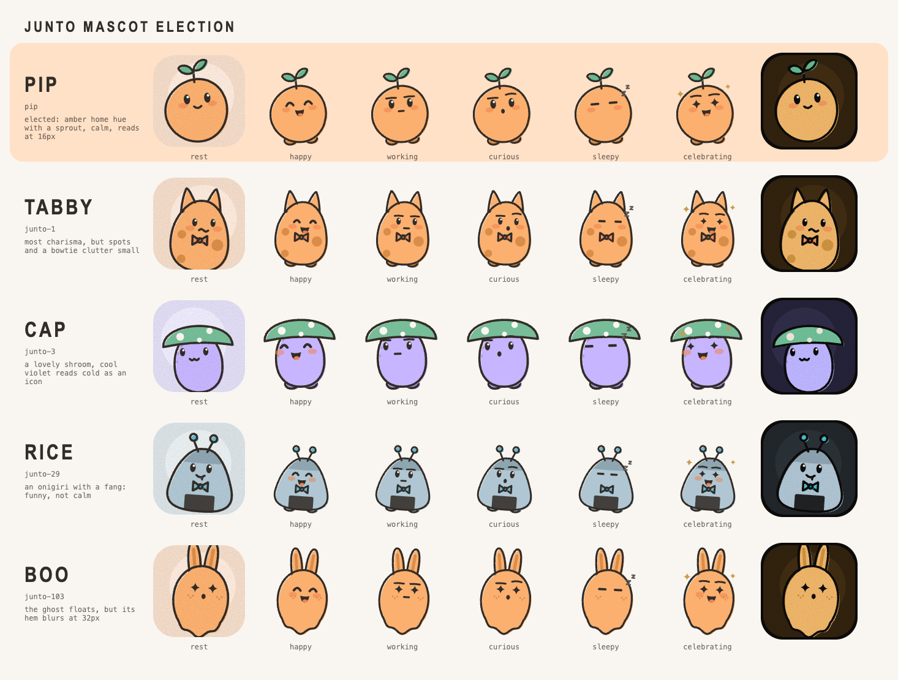

# Junto brand: Pip



**Pip** is the Junto mascot: one of the cast, drawn by the same portrait
renderer every agent seat uses. An amber round critter with a sprout. Amber is
the app's home hue; a pip is the seed a fruit grows from, and Junto is where
small workers grow into a crew. Pip keeps a calm face at every size and its
leaf stays readable at 16px, where the eared and spotted finalists clutter.

Pip is data, not art: `JUNTO_MASCOT` (seed `pip` plus every trait pinned),
`BRAND_FACES` (happy, working, curious, sleepy, celebrating, each an app
expression under a brand name), and `BRAND_CAST` (24 of the crew, traits
pinned so a renderer re-roll never moves them) live in
`src/shared/brand-mascot.ts`.

## Surfaces

| Surface | File | Built by |
| --- | --- | --- |
| macOS icon | `build/icon.icns` (light), `build/icon-light.icns`, `build/icon-dark.icns` | `brand-export.ts icon` |
| Linux icon, README | `assets/brand/junto-icon.png` (1024, light) | `brand-export.ts icon` |
| Renderer copy | `src/renderer/assets/brand/junto-icon.png` (256, light) | `brand-export.ts icon` |
| DMG background | `build/dmg-background.png`, `build/dmg-background@2x.png` | `brand-export.ts dmg` |
| Election board | `docs/brand/mascot-election.png` | `brand-export.ts board` |

The icon follows Apple's macOS grid: a 1024 canvas, an 824 squircle body inset
100, and a soft shadow. Every icns rendition is drawn at its own pixel size;
16 and 32 use the renderer's glyph tier. The DMG is laid out for the
1280 by 720 window and the icon positions in `package.json` `dmg`;
electron-builder pairs the @2x file into a HiDPI background.

## Export

```bash
bun scripts/brand-export.ts kit --out <dir> [--png 512]
bun scripts/brand-export.ts one --out pip.png --expression celebrating --mode dark --size 1024
bun scripts/brand-export.ts icon    # rewrites build/icon*.icns and junto-icon.png
bun scripts/brand-export.ts dmg     # rewrites build/dmg-background*.png
bun scripts/brand-export.ts board   # docs/brand/mascot-election.png
```

`kit` writes `mascot-light.svg`, `mascot-dark.svg`,
`mascot/<expression>-<light|dark>.svg`, `cast/NN-<light|dark>.svg` (the 24
of `BRAND_CAST`), `bare/mascot-<expression>.svg` and `bare/cast-NN.svg` (whole
critters on transparency, feet and all, with an outline that reads on light
and dark), `icon-light.png`, `icon-dark.png`, and `manifest.json`.

Wordmark: uppercase JUNTO in `FONT_DISPLAY`, weight 600, letter-spacing
0.14em, theme token `ink`.
