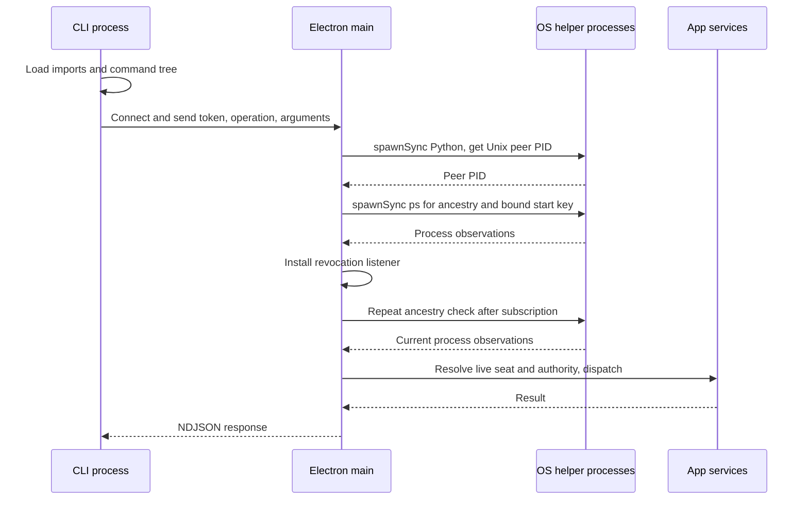

# CLI performance investigation

Captured 7 October 2026 UTC. This is an investigation and proposed implementation sequence, not a claim that the subsystem has been fixed.

## Findings that determine the next change

**The CLI demonstrably blocks Electron main during process identity checks.** A TypeScript/Effect probe issued 24 concurrent packaged `ping` calls in 2.63 seconds. Bypassing CLI startup and sending 24 fresh socket requests still took 1.69 seconds. All requests succeeded. Main-thread samples during those bursts spent 55.5% and 39.3% of their respective observation windows inside `node::SyncProcessRunner::Spawn`. The idle window showed 2.2%.

**Startup is a separate cost.** Packaged `--version`, which never contacts main, took a median 111 ms. A source import experiment took 19 ms for an empty Bun process, 27 ms importing `effect/Effect`, 64 ms importing the Effect root, 95 ms importing WorkSocket, and 193 ms importing the entire CLI. Keep Effect v4, but stop loading every command family before deciding which command runs.

**Coordination can amplify the blocking.** Every admitted request installs a revocation watcher and immediately repeats its ancestry check. All active watchers repeat that check on every process-map lifecycle notification. Long waits share the ordinary socket cap, and some work notifications awaken waits across an entire canvas. These amplification paths are verified in source; their individual contribution has not been isolated in a live benchmark.

The recommended order is: decide whether launch-issued seat identity can replace process forensics; remove Python and blocking identity acquisition; make revocation and wait notifications selective; reduce startup imports; move harness inventory out of request handling; then remove unjustified admission restrictions and complete transport cleanup. Preserve current edge authority, seat-generation revocation, and the single app-owned database connection. Retaining kernel process-bind is one design branch, not an assumed permanent requirement.

## Scope and evidence

The measured app was the installed Junto 0.4.1 on macOS 26.5.2, arm64. The probe used Bun 1.4.2 and Effect 4.0.0-rc.112 from a live Junto seat. It exercised `ping`, `capabilities`, and offline version commands. No mail, task, board, or canvas mutation was used as a load test. The app was not restarted or replaced.

The source investigation began at `d96ebd59f56dead54101fbb4264284756be74670`; the final source receipt review used `f85d05274703e2554055c0419dd184f14c91c1c7`. Other seats were working in this shared tree. Relevant identity, watcher, and live-document function bodies were independently checked in the installed `app.asar` bundle. This establishes equivalence of the implicated paths, not equivalence of the entire installed release and checkout.

Packaged main bundle SHA-256:

```text
19d0b7cfdafe97c74319b59e6a0e04190e6bcb0e78829d427bea924fa5c4ef2a
```

The [evidence JSON](research/cli-performance/evidence.json) contains raw per-request timing rows, startup measurements, native sample counts, and sample hashes. The TypeScript [load probe](research/cli-performance/measure.ts), [startup probe](research/cli-performance/startup.ts), and [sample analyzer](research/cli-performance/analyze-samples.ts) preserve the methods. Tokens and seat identifiers are excluded from these committed artifacts.

The operator's earlier run reported a 24-call burst taking 8.3 seconds and approximately 50% of main-thread samples in synchronous spawning. Its `main.burst.sample.txt` was not recovered in this investigation. Treat those numbers as reported evidence, not a reproduced baseline. An initial corroborating run here took 3.46 seconds through the CLI and 2.15 seconds through fresh sockets; the TypeScript rerun below is the primary receipt. Different launch ancestry, scheduling, background activity, and profiler effects prevent direct comparison across these runs.

## Measurements

All times below are milliseconds. Serial rows report per-call latency; burst rows also report elapsed time for the whole group. Percentiles for 24 requests describe these small samples, not a production latency distribution.

| Path | Requests | Median | Maximum | Group elapsed |
|---|---:|---:|---:|---:|
| Packaged offline `--version`, serial | 6 | 110.9 | 122.8 | 678.0 |
| Source offline `--version`, serial | 4 | 182.3 | 197.8 | 728.7 |
| Packaged `ping`, serial | 6 | 213.8 | 248.5 | 1,310.3 |
| Direct fresh socket `ping`, serial | 6 | 70.5 | 78.4 | 429.0 |
| Direct persistent socket `ping`, serial | 6 | 25.8 | 75.0 | 214.8 |
| Direct fresh socket `capabilities`, serial | 4 | 146.8 | 154.7 | 574.3 |
| Packaged `ping`, 24 concurrent | 24 | 1,546.0 | 2,613.7 | 2,625.9 |
| Direct fresh socket `ping`, 24 concurrent | 24 | 882.6 | 1,687.9 | 1,689.1 |
| Packaged `ping`, serial after bursts | 4 | 204.9 | 207.0 | 812.7 |

All 84 requests in this table succeeded. The persistent group includes its first request, which still acquires peer credentials; later requests reuse the connection's cached peer PID. They still perform request admission and revocation checks.

The direct client runs in the probe process, while CLI requests originate in child processes. Their ancestry depths differ. Therefore these results support separate startup and server costs, but subtracting their medians does not yield an exact component breakdown.

The native sample windows were three seconds idle and four seconds per burst, at a requested 2 ms interval. The analyzer counts each first matching synchronous-spawn subtree once, avoiding nested-frame double counting.

| Window | Main-thread observations | Synchronous spawn observations | Share |
|---|---:|---:|---:|
| Idle | 1,226 | 27 | 2.2% |
| Packaged 24-call burst | 1,656 | 919 | 55.5% |
| Direct fresh 24-call burst | 1,670 | 657 | 39.3% |

These are main-thread occupancy shares over the full window, including waiting and post-burst idle. They are not CPU percentages, freeze durations, or renderer frame-loss measurements. The profiler can perturb execution. SQLite `StatementSync` observations were below 0.2% in both burst windows; this workload does not support blaming SQLite for the measured burst.

An earlier sample contained filesystem symbols, including asynchronous completion callbacks. The evidence calls that category `filesystem_symbols`: it must not be interpreted as a measured synchronous-filesystem share. The primary burst samples did not reproduce a substantial directory-scan share.

## Where serialization occurs



[`process-identity.ts`](../src/main/junto/process-identity.ts):117 executes synchronous `ps` for `lstart`; :381 executes synchronous `ps` for PPID; :480 executes the Python peer-PID helper synchronously. Their configured timeouts are 500 ms for each `ps` and two seconds for Python. Those timeouts bound individual helper calls, not one shared admission deadline.

The Python script performs a Unix socket credential lookup: `LOCAL_PEERPID` on Darwin or `SO_PEERCRED` on Linux. Python is an avoidable runtime and packaging dependency around a small OS operation, not the source of the trust decision itself.

The shared helper has callers beyond work control. [`browser/edge-grant.ts`](../src/main/junto/browser/edge-grant.ts):658 calls synchronous process admission before awaiting its principal grant. [`operator-control/admission.ts`](../src/main/junto/operator-control/admission.ts):51 reads the same peer PID and walks parents to PID 1, with a maximum depth of 64, to avoid accidental operator-socket use by registered agent trees. Neither path was benchmarked here. A work-plane launch credential alone would therefore not remove Python from the entire app; inventory and qualify every remaining caller before deleting the helper/package resource. Operator admission is a separate advertised behavior, not authority implied by a seat credential. Station wire and content-transfer operations were not load-tested.

The successful-path count needs precision. `resolveLive` at :278 returns immediately for an unregistered PID; it does **not** run start-time `ps` at every parent level. With `d` unregistered parent hops before the registered ancestor, admission normally executes one peer helper, `d` PPID helpers, and one start-key helper. The immediate watcher verification repeats the latter walk. Total: approximately `2d + 3` spawned helpers for a fresh successful request. For two hops, that is seven. An already-open connection avoids the peer helper, not both walks. Offboarded entries and rejected callers can add checks; admission failure may run a second walk to distinguish offboarding.

[`work/control.ts`](../src/main/junto/work/control.ts):3179 declares an async line handler, but decoding and admission run synchronously before its first await. [`watchProcessIdentityRevocation`](../src/main/junto/work/control.ts) at :2989 subscribes to process-map changes, immediately rechecks after subscription, and re-resolves ancestry in each notification callback at :3020. The watcher is raced against dispatch for every operation at :3479. Converting only the line handler to async, or putting `spawnSync` inside an Effect, leaves main blocked. Node documents that [synchronous child-process creation blocks the event loop](https://nodejs.org/api/child_process.html#synchronous-process-creation).

This also gives a real app responsiveness path. Main receives terminal-write IPC in [`term/ipc.ts`](../src/main/junto/term/ipc.ts):508, writes the PTY in [`term/local-host.ts`](../src/main/junto/term/local-host.ts):1686, and receives/processes PTY output at :1301 and :2477. Blocking main delays those callbacks and terminal traffic. Renderer paint can continue independently; visible stutter, frame loss, and end-to-end keystroke latency remain unmeasured here. Renderer message/render bursts are a separate unresolved lead.

## Identity architecture, TypeScript and Effect first

The operator's decision is explicit: no Python; TypeScript and Effect v4 first; Rust only if evidence proves those tools cannot satisfy the requirement. The selected identity mechanism is a main-issued generation token injected in the launch environment, with no credential file and no token on command-line arguments. `cli-identity` owns implementation and qualification. `cli-performance` reviews that work and owns this report, startup, transport, storage, and wait analysis. The measurements in this report precede that implementation.

**Selected design: one shared local socket, with one credential per occupant generation supplied in the launch environment.** Identify the seat when Junto launches it instead of reconstructing its process ancestry on every CLI call. Each call automatically presents the credential; main looks up the live generation and still enforces current edges. Offboarding invalidates that generation. Keep tokens out of argv, logs, and emitted artifacts. Deliberate copying by another same-user process is outside the doctrine's advertised protection. No native code is required by this admission mechanism. The process-bind adapter analysis below records the alternative that was evaluated, not a second implementation path.

Separate two responsibilities:

1. **OS observations:** connection peer credentials, process parent, and process birth identity. This adapter reports facts and explicit unavailable/exited errors. It has no seat grants, database access, or authorization policy.
2. **Admission and lifetime:** TypeScript/Effect maps those facts to a registered live seat, checks offboarding and current authority, subscribes to revocation, and owns deadlines, bounded concurrency, interruption, and cleanup.

If kernel process-bind is retained, an initial TS/Effect improvement can make ancestry observation genuinely asynchronous with `spawn` rather than `spawnSync`, fixed executable resolution, bounded output, and a single admission deadline. Where supported, obtain PPID and start key from one observation rather than launching separate helpers. Add an explicit monotonic registry epoch, capture it before awaits, and verify it afterward; subscribe and revalidate before dispatch. The current map exposes snapshots and subscriptions, not this epoch counter. Do not silently preserve authorization from a pre-await snapshot.

That is an interim strategy, not a comprehensive peer-credential replacement. This investigation has not identified a supported public Electron Node API exposing the required Unix peer PID. Merely replacing `ps` with asynchronous TypeScript leaves the Python peer helper unresolved. A proposed internal Bun `bun:ffi` route also fails the production qualification gate: [Bun explicitly documents it as experimental and unsuitable for production reliance](https://bun.sh/docs/runtime/ffi). This does not prove Rust is necessary. It establishes a narrow OS-interface gap if the existing identity contract is retained. Changing that contract can remove the need for this API entirely.

If a supported existing binding cannot cover that gap, evaluate a minimal Node-API adapter against the required runtimes and packaging. [Node-API provides ABI stability](https://nodejs.org/api/n-api.html); that reduces ABI churn but does not eliminate OS/architecture builds, loading, signing, distribution, or runtime qualification. Decide its implementation language from a concrete proof, not from general claims that native code is faster. The repo already packages native PTY resources, but that alone does not prove a new credential adapter is safe or compatible. The current reader obtains the socket descriptor through private `Socket._handle.fd` at `process-identity.ts`:455; descriptor acquisition and lifetime during async work also need qualification, including close/reuse races.

Darwin exposes [`LOCAL_PEERPID`](https://raw.githubusercontent.com/apple-oss-distributions/xnu/main/bsd/sys/un.h) and process parent/start fields in [`proc_bsdinfo`](https://raw.githubusercontent.com/apple-oss-distributions/xnu/main/bsd/sys/proc_info.h). Linux exposes [socket peer credentials](https://man7.org/linux/man-pages/man7/unix.7.html) and [process start ticks](https://man7.org/linux/man-pages/man5/proc_pid_stat.5.html). These facts establish possible adapter inputs, not a finished implementation. Darwin start time uses timeval fields; Linux `/proc` start time uses ticks since boot. Use a platform-specific birth key consistently at registration and observation. Current `ps lstart` is only second-resolution, so preserving current strictness must not be described as perfect PID-reuse protection.

Neither `async ps` nor a native observation is an atomic ancestry snapshot. A child may exit, a PID may be reused, or ancestry may change between observations. The proof must specify these races and fail closed on inconsistent or unavailable observations. Registry-event invalidation alone does not observe arbitrary OS PID reuse. Connection-scoped peer credentials, memoization within one validated walk, and immutable generation-indexed data are candidates for reuse; none justifies a cross-admission TTL authorization cache.

A per-seat environment credential changes kernel-verified process-bind into launch-issued identity. The operator has selected that change; implementation must update the current mechanism specified in `AGENTS.md` and the emitted contract. It fits the [security doctrine](security-doctrine.md): that doctrine explicitly trusts attached agents, enforces operator intent, and disclaims containment of malicious same-user shell processes. The credential maps to a main-issued seat generation, not an arbitrary client seat ID. The existing shared owner-local token plus process walk is the measured old mechanism and should be retired on the affected agent-facing routes.

Revocation must remain a lifetime check, not admission only. For retained process-bind, preserve immediate registration-gap closure, offboarded-ancestor stopping, generation changes, and the existing behavior that an alternative live registered ancestor with identical principal anchors can retain authority. Index watchers by their observed dependencies and make invalidation explicit. Do not simply discard notifications for other principals without proving that those notifications cannot affect the observed ancestry. Coalesce multiple notifications where the same current generation can satisfy the proof once.

Offboarding has another synchronous fan-out: `process-identity.ts`:250 checks every remembered offboarded PID before marking the current generation. Each still-live remembered process can require a start-key helper at :235. Replace that sweep with bounded observation/cleanup work whose scheduling cannot postpone the current generation's revocation. Keep registry mutation and event publication synchronous and small; move OS observation behind an Effect service instead of hiding effects inside synchronous lookup methods. The async service contract needs explicit peer/process-unavailable errors, one deadline, cancellation, an admission witness, and a scoped revocation subscription. A Promise around an unchanged synchronous implementation is insufficient.

### Selected architecture: establish identity at launch

The domain fact needed by a CLI request is its current seat generation and that seat's current edge authority. Reconstructing an OS ancestry chain per request is one way to obtain it; it is not itself the product objective. Compare launch credentials, channels, and retained process-bind before spending effort optimizing the current forensics:

| Design | Admission work | Main advantage | Remaining proof |
|---|---|---|---|
| Private channel created for a seat at launch | Channel maps to a live generation, then normal authority lookup | Removes per-call credential and ancestry acquisition | Channel survival through PTY/shell/harness/Bun; response routing for concurrent CLI children; channel closure/offboarding; packaged and Remote parity |
| Opaque per-generation credential in the launch environment | Credential lookup maps to live generation, then normal authority lookup | Simplest TS/Effect path; no credential files or file reads | Environment inheritance; no token in argv/logs; stale-generation rejection and in-flight revocation |
| Opaque per-generation credential in a file, with its location passed at launch | Credential lookup maps to live generation, then normal authority lookup | Ordinary new sockets still work; TS/Effect can own the whole admission path; keeps secrets file-backed | Location propagation across every supported harness; stale-generation rejection; in-flight revocation; token omission from logs/artifacts; same identity contract on all protected routes |
| Kernel peer credential plus process ancestry | OS observations plus registry resolution and lifetime checks | Preserves today's advertised process-bind mechanism | Qualified OS bridge, observation races, bounded async acquisition, dependency-scoped invalidation |

The environment-token design is the simplest candidate to qualify first under the stated trust model. Main issues an opaque random credential for one live occupant generation and keeps the credential-to-principal map in memory. Descendants inherit it; the CLI supplies it in the existing request's `token` field; main resolves the principal and independently enforces current edges. Offboard, occupant replacement, or runtime shutdown invalidate the old generation and interrupt its scoped work. A stale credential must not resolve to the seat's replacement occupant. There is no client-supplied seat selection, additional product database, new public binary, or OS inspection on each request.

That is a design proposal, not a proven harness integration. Its credential can be deliberately copied by a same-user process, so it must not advertise hostile same-user isolation. The existing doctrine makes no such claim. Still prove protection against ordinary mistakes: wrong/missing credential, inherited stale credentials after offboard, accidental credential reuse across seats, incorrect launch environments, and dispatch using authority captured before a lifecycle change. Environment assembly in [`term/local-host.ts`](../src/main/junto/term/local-host.ts):709–721 merges live seat injection last; the spawn spec passes that environment at :1270. [`term/templates/seat-env.ts`](../src/main/junto/term/templates/seat-env.ts):53–72 already injects work-home/socket paths. These are existing propagation seams, not evidence that every harness passes a newly added field correctly.

The rejected file variant keeps the raw token out of environment dumps, while the injected path still lets a child locate and read it. It adds file creation, read, error, rotation, and cleanup work. The selected environment token removes that work and naturally leaves old descendants holding their revoked old value. Neither form contains a malicious same-user process. File backing has no technical necessity in this design; the environment-token implementation has no credential-file fallback.

**If file backing is selected, credential-file locations must be immutable per generation.** Overwriting a token file at a stable seat path would let old descendants reread the replacement generation's credential on their next invocation. Use a distinct location for each generation and revoke its old mapping; never redirect or repopulate the old location with current authority. The same rule applies to reusing generation-specific socket paths. Prove stale-path errors and temporary-file cleanup without restoring authority to an offboarded process. A process-local admission map and install-local temporary credential files are not new product durability. With environment tokens, old process environments already retain the old credential; no file-path lifecycle is needed.

A private channel may offer even less admission work, but an inherited shared stream does not automatically route replies to the CLI child that sent each request. Request IDs alone cannot stop competing children reading each other's responses. It may need a harness/seat-owned broker or independent logical streams. [`app-process-plane.ts`](../src/main/junto/app-process-plane.ts):1022–1032 supplies environment to `nodePty.spawn` but exposes no extra-descriptor mapping; the inherited-descriptor path is unqualified, not a proven impossibility.

The more practical channel variant is a distinct rendezvous for each generation, reached through normal per-invocation connections. That provides natural response routing without a resident broker. Current [`core/socket.ts`](../src/cli/core/socket.ts):24 and :266–277 resolves `JUNTO_WORK_HOME` and derives `token` and `control.sock`; it does not directly use the separately injected socket-path variables. A generation-specific work-home directory is therefore a concrete integration candidate. An unguessable socket path alone still acts as a copyable local capability, not an inherited uncopyable channel. Compare its extra listeners and cleanup with one shared listener plus generation credentials. Keep resource budgets global across all listeners, rather than multiplying the current 32-client limit by seat count.

Prefer the shared-listener version for the first proof: it keeps today's naturally addressed per-call connections and avoids one server/listener lifecycle per generation. Supply a generation-specific credential through the launch environment, keeping it out of argv and logs. Exact field names remain design work; the existing frame's `token` field can carry it. A per-generation rendezvous is an alternative, not a requirement for revocation. Neither variant needs low per-seat request quotas.

The model does not paste a credential or select a file. Junto supplies the credential when launching the harness, for example through a proposed `JUNTO_SEAT_TOKEN` variable. Tool/shell descendants inherit it. The CLI reads the variable and includes it automatically in the socket request. Normal commands stay unchanged. If file backing is selected, the analogous variable supplies the immutable file path and the CLI reads the file first. These names are illustrative, not implemented contracts. Harness-to-tool inheritance is an explicit qualification requirement; main-to-harness injection alone does not prove it.

For either launch design, keep generation validity separate from edge authorization. A connection can retain a generation witness while each operation still uses current authority. Replace OS lifecycle forensics with app-owned occupant lifecycle events only if the advertised liveness/revocation contract is updated and its failures are tested. Process observations needed for sealed process signaling remain a separate capability plane; simplifying CLI identity does not authorize arbitrary process termination.

Unify identity resolution across agent-facing work/browser/control routes without merging their authority. An ordinary seat credential must never become operator-socket authority or bypass authorial restrictions. Closed overseer operations still require the live human-issued grant. Operator admission and sealed process-signaling contracts require their own review if implementation scope reaches them.

The operator selected the environment token after discussion of the launch alternatives. Update the canonical mechanism, implementation, tests, and emitted docs together rather than retain two competing identity systems. The CLI supplies it automatically at the socket-request level; the model never pastes it or chooses its source. The public command syntax stays unchanged.

Qualification must cover credential preparation before spawn but admission publication only after the intended live occupant is established; failed-spawn cleanup; every supported harness/tool environment; app and Remote restart/re-attachment; offboarding and replacement; and in-flight generation revocation. Unknown/revoked generations should have a seat-moved-on error rather than a misleading instruction to launch Junto. The file variant additionally needs missing-file/dead-path errors and cleanup. These are concrete lifecycle/UX requirements, not claims that the new design already passes them.

## Startup and command loading

[`src/cli/main.ts`](../src/cli/main.ts):1–116 statically imports command families and constructs the complete command tree. The early-dispatch decision at :157 happens afterward. [`early-dispatch.ts`](../src/cli/early-dispatch.ts):9–12 imports content-transfer, companion, and Station implementations merely to obtain command constants. These are concrete import dependencies to remove from the initial path.

The six-run source import experiment measured total child-process time:

| Variant | Median ms | Range ms |
|---|---:|---:|
| Empty Bun | 19.4 | 16.1–34.3 |
| `effect/Effect` | 26.7 | 26.1–28.0 |
| `effect` | 63.6 | 62.4–68.6 |
| WorkSocket module | 95.3 | 90.7–101.4 |
| Full CLI module, without invoking main | 192.7 | 184.5–199.7 |

These source-runtime results are not predicted packaged savings: compilation, tree shaking, module initialization, and OS process startup differ. A short source CPU profile also showed initialization in Effect and Node modules; its duration and symbol attribution are too noisy for precise blame. The controlled import variants are the stronger evidence.

Use a thin dispatcher that recognizes the selected family before loading its implementation. Keep literal command names in a small shared module. Fast offline commands should not load browser, Station, companion, or work services. Precompute declarative discovery where appropriate while preserving help, schemas, examples, output envelopes, and exit codes. Retain idiomatic Effect within each loaded command. Verify the packaged binary, not only source imports. [`build-standalone-cli.ts`](../scripts/build-standalone-cli.ts):64 remains the single public CLI build path.

[`core/batch.ts`](../src/cli/core/batch.ts) already runs per-item effects with default concurrency five. Batching amortizes process startup; each item still opens a separate socket and pays server admission. Raising batch concurrency before server changes increases contention.

## Request admission and transport

**This is the local CLI/local app transport. The number 32 is an application policy, not a technical capacity limit.** [`work/control.ts`](../src/main/junto/work/control.ts):2781 hard-codes it, :2801 clamps runtime overrides to that ceiling, and :3163 closes connections beyond it before authentication. At :3629 every complete incoming line immediately retains a new handler; there is no corresponding bound on requests within one socket. The cap therefore does not even express a consistent execution-work bound. Conversely, 32 legitimate waits can occupy it despite doing little work while asleep. This is source-verified; saturation was not exercised against the live operator app.

History receipt: `c0cdd3439d499167cae1ae571ec93bba5aa6b742` introduced the constant in “bound local control client admission” along with similar local control changes. Its work-control diff provides no measured derivation for 32. This establishes the policy's introduction, not the author's unstated rationale.

No measured capacity evidence here justifies 32 or introducing a collection of low per-seat quotas. Removing blocking process forensics is the primary scaling change. Review removing the fixed socket ceiling after that change; resource cleanup and stream backpressure should address actual resource pressure. If a retained process-bind adapter launches helpers, bound that expensive acquisition work specifically. Add scheduling/fairness only where overload measurements show it is needed to keep terminal interaction responsive. Long event waits should not be rationed as if each were an active CPU job.

There is no single intrinsic maximum for a "CLI call": the binary starts a process and requests app work, whose duration and resource use vary by operation. Physical ceilings are the app's effective file-descriptor limit, listener backlog, memory for processes/buffers/subscriptions, available CPU/event-loop time, and serialized database work. These do not imply a product-level seat cap. On this machine, `sysctl kern.maxfiles kern.maxfilesperproc` returned 491,520 system-wide and 245,760 per process; `launchctl limit maxfiles` reported default soft 256 / hard unlimited, while this shell reported 1,048,575. None of those reads establishes the running app's effective descriptor limit, and descriptor counts are not request throughput. The app's actual RLIMIT, resource headroom, and post-fix saturation point remain unmeasured.

The reproduced direct burst completed 24 requests in 1.69 seconds, about 14.2 requests/second over that group. That is an observed workload result under today's blocking implementation, not a hard ceiling or prediction of the replacement. Determine practical capacity with a nonblocking implementation and increasing load while measuring main/terminal latency; do not ask the operator to choose an arbitrary low seat count to justify the current cap.

Handle idle or incomplete-frame connections with a deadline. Keep the 8 MiB protocol ceiling, but decode frames incrementally rather than repeatedly concatenating and copying accumulated buffers. A tighter limit for small control requests can be considered without shrinking existing payload contracts blindly. Yield between bounded groups of frames. At :2889 responses use `socket.write` without handling backpressure; response queues should have bounded bytes and drain handling.

[`core/socket.ts`](../src/cli/core/socket.ts):70 uses `Effect.callback`, creates a socket per call at :137, and destroys it when a response/error settles. The callback returns no interruption finalizer. Add scoped cleanup of the socket, listeners, and timer so outer Effect interruption releases them immediately. This cleanup gap is source-verified; a leak duration was not measured.

On server socket close at [`work/control.ts`](../src/main/junto/work/control.ts):3670, the connection is removed from the client set, but already-running operation fibers are not interrupted there. Scope read-only wait subscriptions to their caller connection. Preserve retained mutation flights and shutdown drain receipts: disconnecting a client does not prove a dispatched write failed.

The client already marks selected dispatched mutations as `UncertainCompletion` and forbids blind retries. Preserve and audit that behavior across mutation families when changing pooling or cancellation. `msg.list` is classified as authorial in [`main-authoring-gate.ts`](../src/main/junto/main-authoring-gate.ts):112 because it can mark mail read; it cannot be casually put in a read-only cancellation bucket.

The persistent-socket experiment makes connection reuse worth testing after identity changes. A scoped sequential connection within one batch is the smallest candidate. Multiplexing requires request IDs, response routing, per-item deadlines and ordering, cancellation, and current authorization on every request. The wire supports IDs; today's CLI waits for the first response and sends no correlation ID. A persistent per-seat process can also amortize startup, but its authenticated process lineage and revocation semantics need proof. A global multi-seat broker, new public binary, or MCP migration is not justified by these measurements.

## Wait notifications and document reads

[`work/seat-observation.ts`](../src/main/junto/work/seat-observation.ts):461 and :832 implement event-driven seat and task waits, with registration-gap rechecks and cleanup. They are not polling loops. Preserve these useful guarantees.

Seat waits subscribe to a canvas-wide change stream at :541. Task waits subscribe to work changes at :883 using only the canvas name, ignoring the available sink identity, and also watch canvas changes at :891. [`seat-observation-live.ts`](../src/main/junto/work/seat-observation-live.ts):31 reads projected documents; :46 subscribes to canvas changes. [`canvases.ts`](../src/main/junto/canvases.ts):1656 feeds work mutations into that change stream. One unrelated mutation can consequently provoke document re-observation across multiple waits in that canvas. The immediate post-subscription checks intentionally add reads to close races.

Separate authorial topology/authority generations from work-state changes. Route work notifications by engine, canvas, sink, and item where known; maintain conservative invalidation for unknown scope. Coalesce repeated notifications by committed revision. For seat state, target binding subscriptions already exist and should remain the normal completion path. A topology change must still revoke or rebuild the authorized target set immediately.

[`work/mutation-seam.ts`](../src/main/junto/work/mutation-seam.ts):801 uses a global mutation listener set and announces canvas/sink hints at :810. Any redesign must tie publication to a successful commit and preserve notifications where query bindings do not identify a precise sink. Guessing a narrow scope would introduce missed transitions.

The document path already contains important caches. [`canvases.ts`](../src/main/junto/canvases.ts):366 caches the active portfolio against a durable identity witness. Projected documents around :430 are keyed by authority identity and work revision, and cache publication occurs after the read lease succeeds. `liveDocuments` around :1732 reads through the active portfolio path, then maps and sorts documents. It does **not** reread every stored document body on every ping. [`work/repository.ts`](../src/main/junto/work/repository.ts):5036 reads the revision by key; unchanged work snapshots can be reused.

There is still repeated work to measure: [`canvas/records.ts`](../src/main/junto/canvas/records.ts):459 computes active identity, including Command Center topology; the control path resolves one seat across all live documents at :3281 and filters/sorts process-map snapshots. Build immutable indexes by principal and authority generation, published coherently with existing cache witnesses, to avoid repeated whole-portfolio scans. Point observation of a task or mailbox is preferable to constructing a full projected document solely to find one item, provided edge authority uses the same current transaction/generation witness.

## Harness discovery and other main-thread work

`capabilities` and doctor paths probe managed harness installs in [`work/control.ts`](../src/main/junto/work/control.ts):1145–1189. [`term/templates/harness-install.ts`](../src/main/junto/term/templates/harness-install.ts):72 rebuilds the search path; :90 enumerates tool directories; :227 repeats resolution per harness. Shim liveness at :113 and help probing around :156 use synchronous child processes, with limited caches. [`adapters/exec.ts`](../src/main/junto/adapters/exec.ts):415 uses synchronous directory enumeration and file checks while discovering version-manager installations.

Move inventory into one asynchronous background refresh service. Compute the candidate path list once per refresh, bound probes, and serve capabilities from its current snapshot with freshness/probe status. Refresh on relevant settings changes and explicit doctor requests. Launch should still verify the selected executable. A freshness cache for installation inventory is appropriate; it is not equivalent to caching live caller authorization.

[`term/session-existence.ts`](../src/main/junto/term/session-existence.ts) also performs synchronous session-file discovery used by session/onboarding fallback paths. Index or perform that discovery asynchronously, preserving explicit named-session resume. It is not on every ping and has not been isolated as a burst bottleneck.

[`state/sqlite-client.ts`](../src/main/junto/state/sqlite-client.ts):51–112 executes synchronous SQLite operations inside Effects and protects leases with one semaphore. That still uses main's thread, but the observed ping samples show little SQLite time. Optimize statement and projection work before considering a storage-thread redesign. The single app runtime and one `StateEngine` connection are governing architecture. A CLI database connection, second product store, or helper-owned database is not a performance fix. Moving ownership would be a distinct design requiring coherent transaction, notification, shutdown, and sole-owner proofs.

Likewise, [`main-authoring-gate.ts`](../src/main/junto/main-authoring-gate.ts):248–295 retains actual write promises for shutdown. Its `run` does not implement a FIFO or semaphore. It is not the demonstrated source of request serialization, and replacing it would risk drain correctness without addressing the measured cost.

## Implementation sequence and proof gates

| Order | Deliverable | Required evidence before claiming success |
|---|---|---|
| 1 | Implement and qualify the selected environment-issued generation token, with TS/Effect lifetime service | Launch/harness proof; no blocking helper waits in affected app-owned request/lifecycle paths; current edge checks and generation revocation; canonical identity contract updated; remaining Python callers inventoried separately |
| 2 | Generation-scoped identity notifications and targeted wait streams | Unrelated lifecycle/work events avoid repeated reads; relevant revocation and registration races still close; retained process-bind also preserves equivalent registered ancestors |
| 3 | Thin CLI entry and lazy command families | Packaged offline/startup latency and import footprint improve; help/schema/examples/output parity passes |
| 4 | Async cached harness/session discovery | Cold and warm discovery measured independently; refresh freshness visible; executable and named-session validation preserved |
| 5 | Remove unjustified socket restrictions; backpressure and scoped cleanup | Increasing-load/slow-consumer/disconnect/many-wait measurements; resource cleanup and mutation drain tests; any retained work budget justified by observed cost |
| 6 | Generation-indexed seat authority and point observations | Transaction/lease consistency, edge revocation and immutable publication tests; reduced reads at unchanged generations |
| 7 | Optional connection reuse within a batch/seat | Compare against optimized stateless CLI; exact correlation/cancellation/uncertain-write behavior; current identity and authority per operation |

Add monotonic spans for client launch/import, connect, queue delay, token/decode, peer credential, each ancestry walk, subscription recheck, authority, dispatch, SQL, and response flush. Distinguish elapsed queue time from synchronous main occupancy. Record event-loop delay, helper count, active waits/watchers, dispatch queue depth, notification fan-out, and queued response bytes. Measurements must not log tokens, mail, or private arguments.

Use a deterministic test app to run bursts while measuring terminal input-to-PTY/output-to-renderer latency and a renderer heartbeat/trace. A native main-thread sample alone cannot establish a visual frame-loss result. The installed app had no observed main-process TCP debug listener; this investigation did not enable one or restart it to acquire renderer tracing.

Existing [`process-identity.test.ts`](../tests/process-identity.test.ts), [`work-control-process-revocation.test.ts`](../tests/work-control-process-revocation.test.ts), [`work-control-transport.test.ts`](../tests/work-control-transport.test.ts), and SQLite lease tests cover substantial semantics. Their injected identity observations do not measure real OS helper cost. Qualify the selected identity design on macOS/Linux and supported Electron/Remote runtimes, plus packaged burst tests. For retained process-bind, cover PID reuse, exits during observation, offboarded ancestry, and alternative identical ancestors. For launch credentials, cover harness/tool inheritance, wrong/missing credential, stale generation paths, failed spawn, offboard, and restart/re-attachment. Both require current edge authority, delayed dispatch revocation, unrelated notifications, connection closure, and shutdown fixed-point drain. Retire mechanism-specific tests when their mechanism is deliberately replaced; do not preserve obsolete process-forensics requirements by accident.

Enforce aggregate throughput and p95/p99 terminal responsiveness across increasing load. Do not promise a sub-millisecond identity path or a specific frame-rate recovery before implementing and measuring it. The operator challenged the low socket cap and the request for a seat-count target: the report therefore treats 24 concurrent calls as a reproduced test case, not an agreed capacity ceiling. Low limits require a technical justification rather than becoming architecture assumptions.

## Reproducing the probes

Run from the repository root inside a live Junto seat. Select the actual app main PID; do not accidentally sample a separate development app. Keep outputs outside the repository:

```sh
bun docs/research/cli-performance/measure.ts /tmp/junto-cli-repeat MAIN_PID CLI_PATH
bun docs/research/cli-performance/analyze-samples.ts /tmp/junto-cli-repeat
bun docs/research/cli-performance/startup.ts /tmp/junto-cli-startup-repeat.json
```

The load probe uses one bounded 24-call burst per transport, sequential serial groups, and native `sample` on macOS. It reads the existing owner-local socket token without printing it. The startup probe contacts no app. Raw native traces from this run remain at `/tmp/junto-cli-investigation.BmYx5b`; their hashes and matching native frames are committed in the evidence JSON. Scratch files are temporary and are not a durable raw-trace archive.

Outstanding evidence is explicit: implementation qualification and post-change performance of the selected identity replacement, Linux runtime performance, mutation-heavy workloads, wait-saturation behavior, visual stutter, and renderer burst attribution. The investigation establishes the current blocking path and prioritized architecture changes. It does not yet establish their post-change performance.

## Delivery validation

`bun run typecheck` passed. `bun run test` passed both lanes: 528 shared test files / 5,642 tests and 264 isolated test files / 3,100 tests, with their reported skips. `bun run lint:no-middot` passed. The three reproduction scripts also passed a standalone strict TypeScript check; the portable startup probe and sample analyzer were executed. The live timings are the recorded primary run, not a performance result under concurrent unit-test load. Identity findings and the immutable-path correction were reviewed with `cli-identity`; proposed replacements still need implementation qualification.
